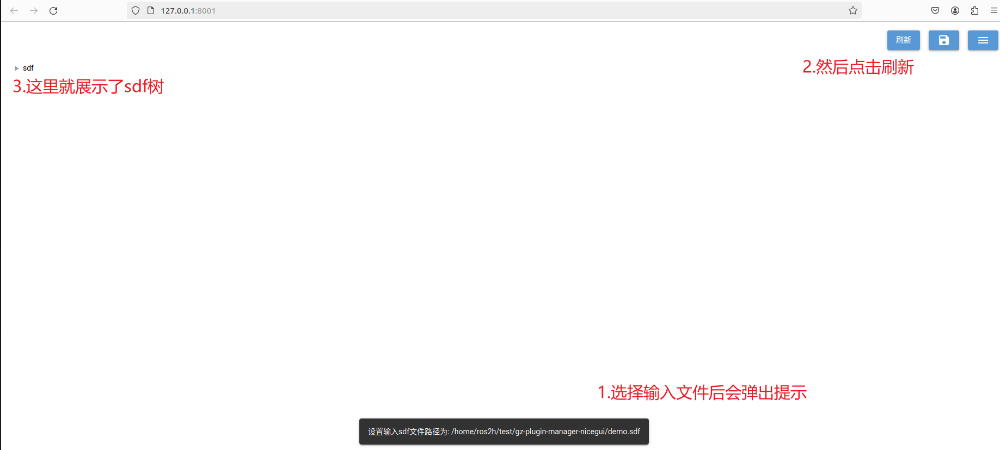
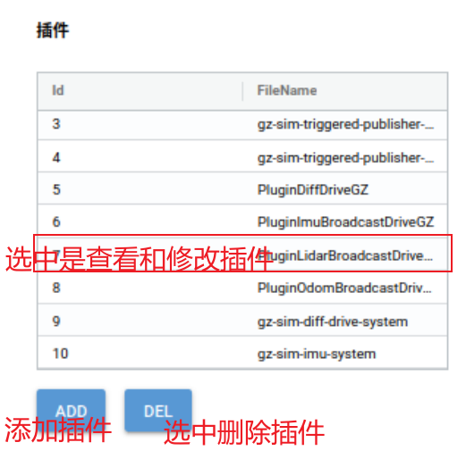

### 一：环境构建和打包执行

**下载**：

`git clone https://gitee.com/yi315/gz-plugin-manager-nicegui.git`

**本机环境**：

Python 3.10.12

**可能需要装的开发包**：

```python
# requirements.txt
nicegui==1.4.15
pyinstaller==6.4.0

# shell
pip install -i https://pypi.tuna.tsinghua.edu.cn/simple -r requirements.txt
```

**直接运行**：
`python main.py`
**打包出可执行文件**：
`python build.py`

生成plugin_manage_web   linux下可执行文件

`./plugin_manage_web`   

### 二：使用说明

./plugin_manage_web   

弹出网页，如下，最好默认使用火狐浏览器（谷歌浏览器有时会出bug）

主界面：


初始运行会自动创建配置文件，在可执行同级目录下（config.ini）

1. 选择输入sdf文件，也就是要展示和后续操作的sdf文件


2. 选择后刷新



3. 界面简介


界面中的所有可编辑文本的区域都可以修改，当切换树枝（自动保存）或点击保存按钮时会保存到输出文件中。

4. 插件列表区详细



a)获取插件列表和添加插件


可以从已经选择的输入文件获取插件列表，或者可以从一个专门的插件xml文档中读取（原理就是扫码xml文件的plugin标签，plugin标签的内容就是未来添加的插件模板）

选择一个输入文件后：


<br/>

刷新后：


配置要插入的插件属性（有默认值）


点击ADD添加插件并自动刷新界面，同时会自动保存到输出文件中。

<br/>

b)删除插件


点击DEL删除插件并自动刷新界面，同时会自动保存到输出文件中。

c)查看和修改插件


切换树枝（自动保存）或点击保存按钮保存
